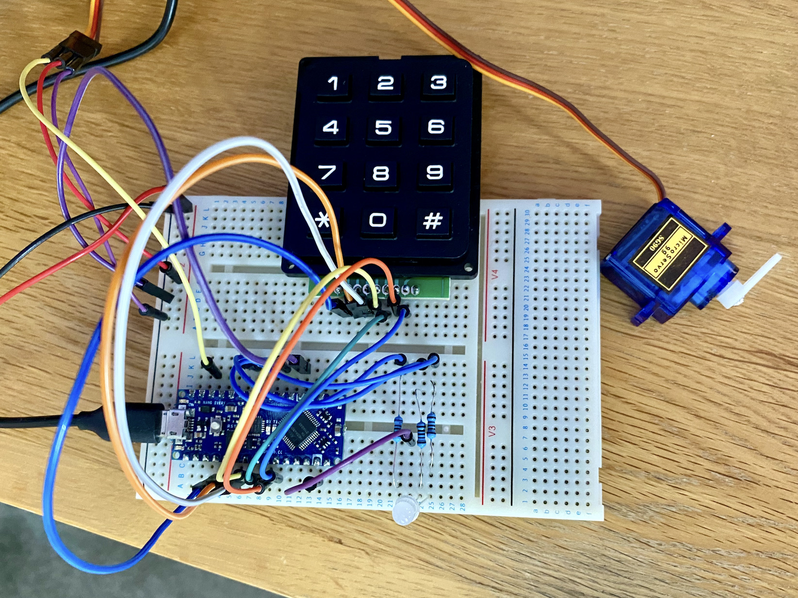

# Locking Diary
## DIY secure journal with numpad lock

*Phil McCarthy, May 2023*

### What is this project?

My daughter saw a diary in the toy shop with a number pad and electronic lock. I told her we weren't buying it - I could make one like that myself! She called my bluff... and didn’t forget about it. :grimacing:

So yes, making this will cost you much, much more in electronics components, 3D printing and PCB fabrication than it would cost to buy your child a cheap toy secret diary. But at least you made it yourself and had fun. :wink:

### Demo

See this video to see how the unit operates (TODO)
Instructable here: TODO

### What's included in this repository?

Original OpenSCAD designs and related assets for all parts, STL files for unmodified reprints (also Prusa project files which will save you time when slicing if you have a Prusa), KiCAD project files and gerbers for modifying/fabricating the PCB, and documentation.

Included in the documentation is [the full parts list](docs/BOM.md), [assembly instructions](docs/assembly.md), and [the printing settings that worked for me](docs/printing.md) when printing the parts out.

The rest of this readme contains information about the design choices for the project.

### Electrical Design

This is the first prototype for the electronics:

An SG90 servo moving an arm 90 degrees back/forth into a recess was chosen for the lock mechanism, due to:

- low cost
- fairly electrically efficient; 750mA **stall current** at 5v (much less unencombered) vs solenoid 1A+ for *normal operation*, with excess heat generated
- easy to control, just PWM signal
- self contained vs lead screw linear actuator; don’t need driving with mosfets / driver ICs
- No additional components required

A matrix style hobbyist number pad was chosen rather than wiring 12 momentary switches up manually; bang for buck the result is tidier and more tactile.

Arduino Nano Every MCU was chosen due to:

- High pin count - need 7 pins for number pad matrix circuit alone
- ability to drive PWM at 5v without needing extra logic level conversion
- doesn’t need to be particularly fast/high powered/lots of memory.

For power, need headroom for 1A (~60mA for RGB LED, 20mA for Arduino and 750mA max for servo). To keep cost down, but battery footprint compact, AAA batteries can be positioned down the spine of the diary. An Adafruit Miniboost 5V module converts 2-6V into 5V regulated, and supplies ~1A. rechargeable AAAs are 950+mAh, 1.2vx3 = 3.6v (1100mA from Miniboost at this V) which is more than sufficient. Micro slide switch pulls the enable pin on mini boost active low / ground to stop power supply efficiently.

The Arduino's VIN pin takes 7-21v due to builtin voltage regulator. We already have a regulated 5v supply, so using the 5v output pin as an input to avoid extra DC up-conversion components as space is limited; need to make PCB as small and low profile as possible. (5v pin as input not recommended, and voltage fluctuations can lead to MCU processor damage according to forum posts, but can't source specific technical doumentation that says this can't be done with a single regulated supply where the USB won't be used in conjunction. On testing it seems to work fine).

### Firmware design

For persistent state, can use Nano Every’s EEPROM to store new pin when lock is open (by pressing # key 3 times). RGB led provides feedback about mode the lock is in - blue for “enter new pin”, green for unlocked, red for locked.

**TODO TODO TODO**

### Mechanical Design

rectangular pcb and mount / glue keypad on top. runs can be under keypad, and servo connector can be in vertical middle
pcbs mounted to book cover using M5 chicago screws, with 3D printed fascia on top

### Legal stuff
This project is not a commercial product. The designs are made available free and open source. The PCB design, CAD models and microcontroller firmware are shared under the [GPLv3 license](https://www.gnu.org/licenses/gpl-3.0.en.html). Please don't assume anything works, for any particular purpose. Built completely at your own risk.